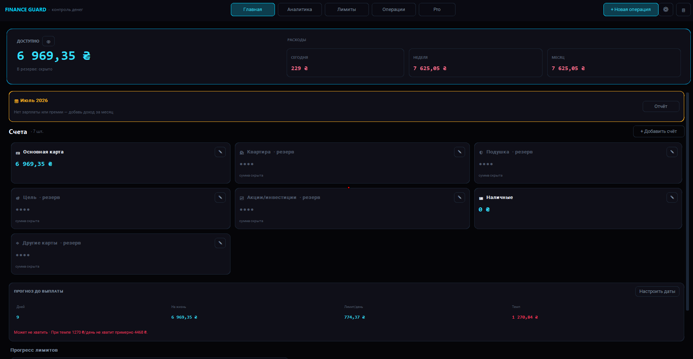
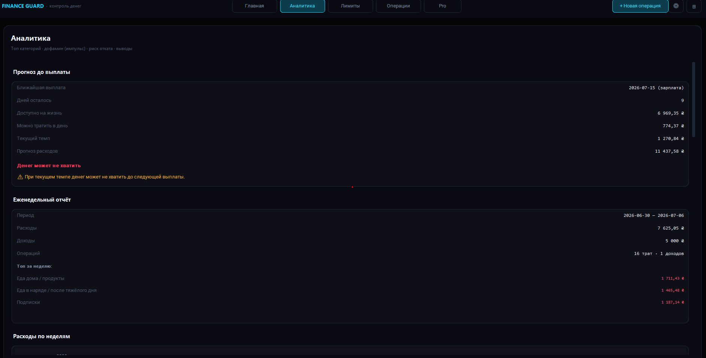
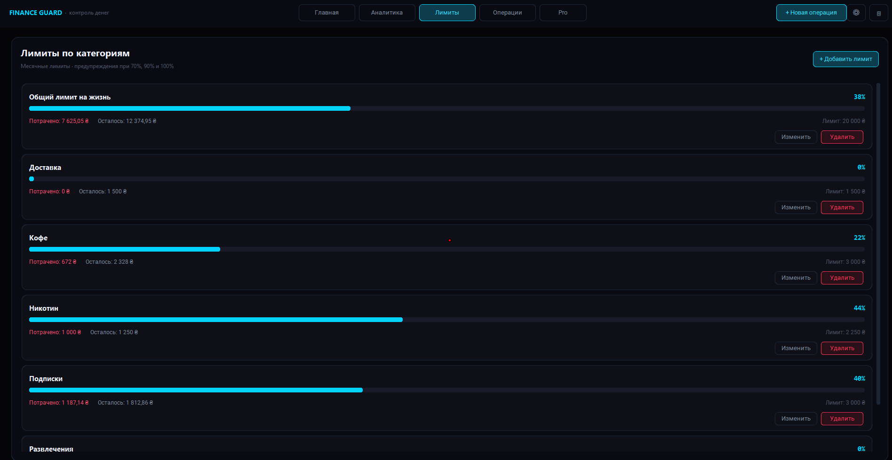

# Money Control System

Desktop приложение для контроля личных финансов.



## Возможности

- Управление несколькими счетами
- Учёт доходов и расходов
- Установка лимитов на траты
- Предупреждения при приближении к лимиту
- Выделение рискованных категорий
- Сохранение данных в JSON
- Удобный тёмный интерфейс

## Скриншоты





## Технологии

- Python 3
- CustomTkinter
- JSON

## Как запустить

```bash
pip install customtkinter
python main.py
